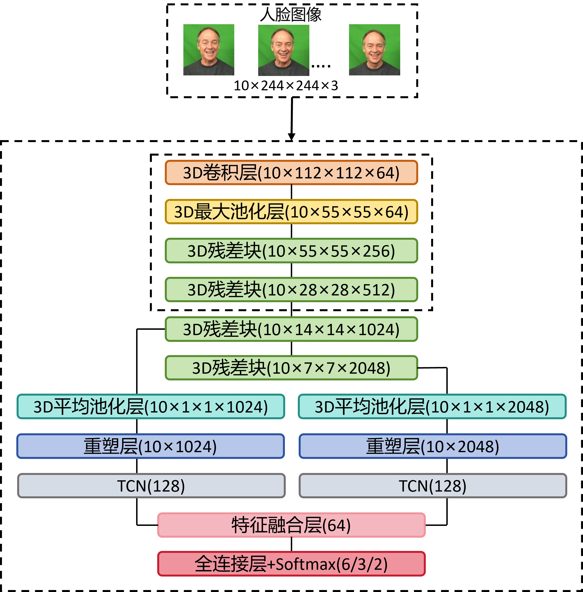
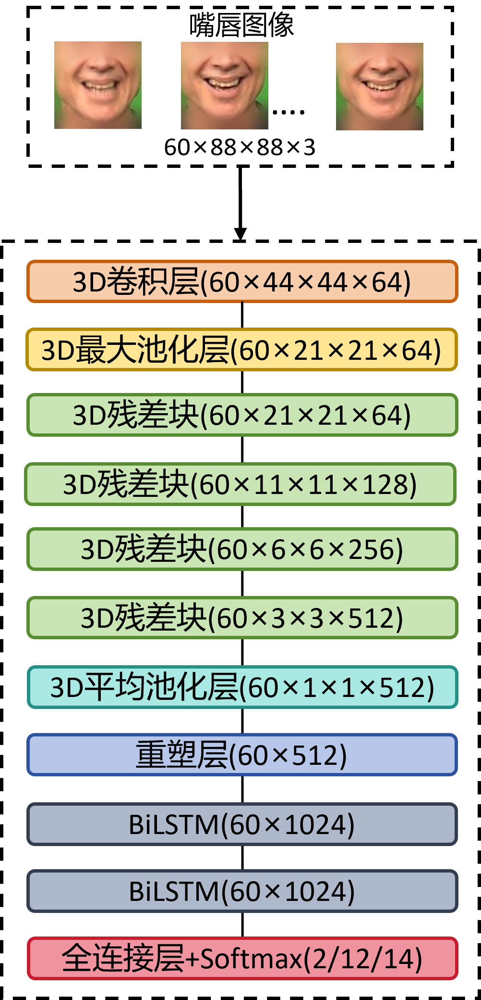
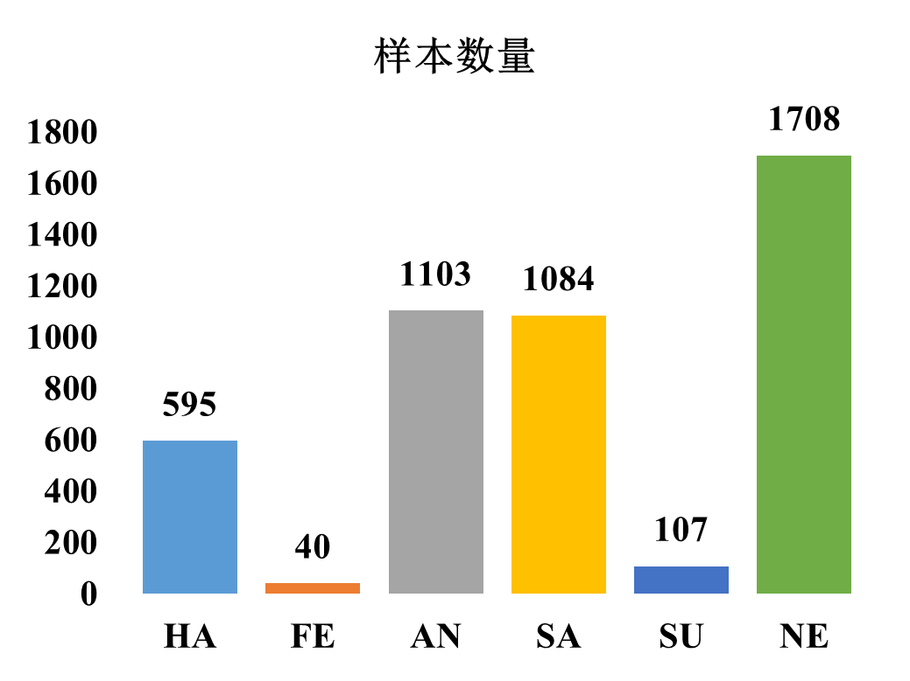
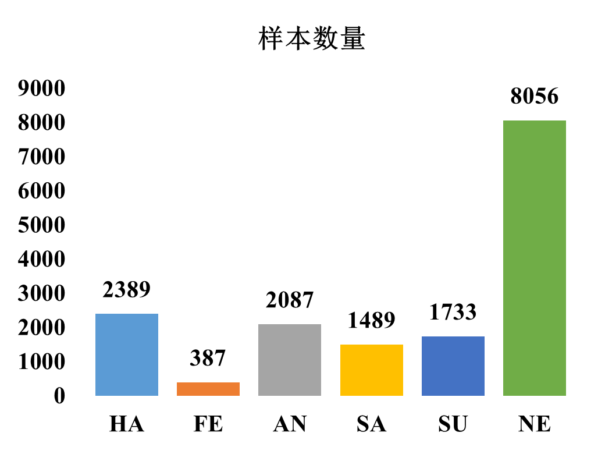
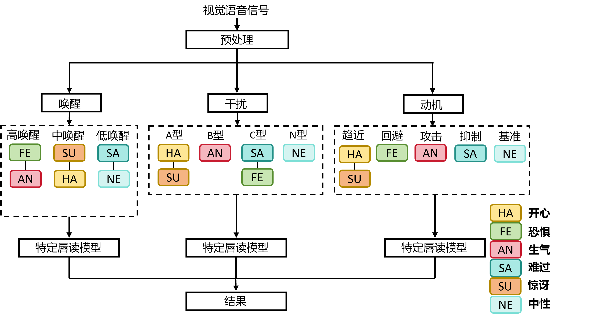

# 融合三维卷积与时序网络的情感唇读系统

周新民1,2)\*, 余焕杰3), 徐云凯1), 江华晋4)

1) (湖南工商大学人工智能与先进计算学院 长沙 410205)
2) (湘江实验室 长沙 410205)
3) (湖南工商大学计算机学院 长沙 410205)
4) (韶关学院信息工程学院 韶关 512005)

(zhouxinmin2699@163.com)

---

**摘 要**: 本文针对情感语音导致唇读性能下降的问题, 提出一种融合三维卷积与时序网络的两级情感唇读系统. 系统采用"先情感, 后内容"的级联策略: 首先通过3DCNN-TCN网络从视觉序列中识别说话人的情感状态; 随后, 依据判别出的情感类别, 调用为该状态专门优化的3DCNN-BiLSTM模型进行唇部运动到文本的识别. 本文创新性地提出了唤醒度分级、发音动作干扰模式及情感动机维度三种情感建模策略, 以指导专用模型的构建. 在IEMOCAP和MELD两个公开情感数据集上的实验表明, 所提方法能有效建模情感引起的发音变异, 在两个数据集上一致优于使用中性或混合情感数据训练的基线模型, 其中基于唤醒度分级的策略取得了最优性能.

**关键词**: 情感唇读; 视觉语音识别; 三维卷积神经网络; 3DCNN; TCN; BiLSTM

**中图法分类号**: TP391

---

**Integrating 3DCNN and Temporal Networks for Emotion Lip-Reading**

Zhou Xinmin1,2), Yu Huanjie3)\*, Xu Yunkai1), and Jiang Huajin4)

1) (School of Artificial Intelligence and Advanced Computing, Hunan University of Technology and Business, Changsha 410205)
2) (Xiangjiang Laboratory, Changsha 410205)
3) (School of Computer Science, Hunan University of Technology and Business, Changsha 410205)
4) (School of Information Engineering, Shaoguan University, Shaoguan 512005)

**Abstract**: The paper introduces a two-stage emotional lip-reading system to address performance degradation caused by emotional speech. The system follows an "emotion-first, content-second" cascade: a 3DCNN-TCN network first identifies the speaker's emotional state from visual input, then a dedicated 3DCNN-BiLSTM model—optimized for that emotion—performs lip-reading. Three novel emotion modeling strategies are proposed: arousal grading, articulatory interference patterns, and motivational dimensions. Experiments on IEMOCAP and MELD corpora show the method effectively models emotional variations, consistently outperforming baselines trained on neutral or mixed data across both datasets, with the arousal-graded strategy performing best.

**Key words**: Emotion Lip Reading; Visual Speech Recognition; 3DCNN; TCN; BiLSTM

---

## 1 引言

当人类进行言语交流时, 由发音器官同步产生的听觉与视觉信号之间存在着相关性. 这一现象在听觉受干扰(如环境嘈杂)时尤为明显, 人们会自然地注视说话人的唇部运动以辅助理解, 即所谓的"唇读". 受此启发, 视觉语音识别技术应运而生, 其目标是从纯粹的唇部运动序列中识别出对应的语音内容. 近年来, 随着深度学习的突破, 尤其是在有限词汇任务上, 自动唇读系统的性能已超越人类, 并广泛应用于人机交互与辅助通信等领域.

然而, 当前领先的唇读方法在情感中性的语音识别任务中表现出色, 却在真实场景中面临严峻挑战: 当语音承载强烈情感时, 其识别性能会显著下降. 情感会系统性改变语音的声学特性(如音色、音高)和视觉特性(如口型、发音时长与力度), 这使得情感鲁棒的视觉语音识别成为一个具有挑战性的研究问题. 语音情感识别领域在过去十年间积累了大量成果, 但如何构建能够理解情感状态下语音内容的视觉识别系统, 仍缺乏方法论和充足的标注数据.

视觉语音识别的技术演进为情感唇读提供了方法论基础(详见第2节). 然而, 现有方法均假设语音为情感中性, 当语音携带情感时, 唇部运动的时空模式会产生系统性扰动, 导致识别性能衰退. 如何建模并适应情感引发的发音变异仍是尚未解决的技术难题. 其根本瓶颈在于数据: 大规模唇读数据集(如LRW、LRS、GRID)缺乏情感标注, 而具有情感标注的多模态数据集(如IEMOCAP、MELD)规模有限.

为应对上述挑战, 本文提出一种融合三维卷积与时序网络的情感唇读系统. 其核心创新在于采用"先情感, 后内容"的级联策略: 系统首先从视觉信号中识别说话人的情感状态, 随后根据判别出的情感类别, 调用一个为该情感专门训练的唇读模型进行短语识别. 这一策略本质上是为不同的情感状态建立专用的视觉发音模型, 从而解决多情感场景下的唇读难题.

本文的主要贡献如下:

1. 提出了一个3DCNN-TCN情感识别网络与3DCNN-BiLSTM唇读网络的两级系统框架.
2. 引入了三种基于情感内在影响机制(唤醒度、发音动作干扰、行为动机)的新型情感建模策略, 为情感唇读提供了新的理论视角.
3. 在公开情感数据集上的实验表明, 所提方法显著提升了情感语音的唇读准确率.
4. 提供了全面的实验分析, 详细探讨了不同情感、效价及强度对唇读性能的具体影响.

## 2 相关工作

### 2.1 视觉情感识别的先进方法

近年来, 视觉情感识别(VER)领域因大规模数据集的出现和深度学习技术的推动而获得了长足发展. 面部表情、身体姿态、手势等视觉线索均可用于情感信息的提取. 在主流方法中, 卷积神经网络与循环神经网络及其变体(如LSTM、GRU)的表现已明显优于传统方法.

CNN在静态图像或视频帧的空间特征提取方面表现突出. 研究者通常以VGG、ResNet等在大规模数据集上预训练的2D CNN作为骨干网络, 通过微调使其适应情感识别任务. 为建模情感的动态演变, RNN及其变体被用于处理CNN提取的帧级特征序列, 捕捉时间维度上的依赖关系. 近年来, 注意力机制与Transformer架构的引入增强了模型对关键表情帧或面部区域的聚焦能力. 王金伟等人提出的时间分段网络便结合了注意力机制来加权不同视频片段的情感贡献. 三维CNN则直接从视频片段中同步提取时空特征, Carreira等人提出的I3D模型在视频情感识别中展现了这一思路的可行性.

对于多模态情感识别(如融合音频与视觉), 研究者探索了在特征层、决策层或通过注意力机制进行信息融合的不同策略. 在特征层, 早期工作如Noroozi等人通过拼接或基于核的方法融合音视觉特征; 在决策层, 则通常对单模态分类器的输出进行加权或投票. 近期研究更多采用基于注意力机制的融合, 以动态捕捉模态间的互补信息, 例如, Tsai等人提出的跨模态Transformer和Hazarika等人开发的记忆融合网络, 均能有效学习模态间的交互并提升情感识别性能.

### 2.2 唇读技术的先进方法

视觉语音识别(VSR)或唇读技术的发展同样深受深度学习驱动. 早期系统依赖于手工设计的视觉特征(如唇部几何特征), 随后处理流程逐渐被端到端的深度网络所取代.

现代唇读系统通常遵循"视觉编码-时序建模-分类/解码"的范式. 视觉编码器多采用2D或3D CNN, 以ResNet或VGG为骨干网络进行微调, 负责逐帧提取视觉特征. 时序建模层的选择较为多样: RNN(如LSTM、GRU)用于捕捉帧间依赖, Transformer则通过自注意力机制建模全局上下文, 以捕获发音过程中的长距离协同发音效应.

训练策略上, 除了标准的交叉熵损失, 知识蒸馏、自蒸馏等技术也用于提升模型性能. 大规模在野唇读数据集(如LRW、LRS)的出现, 为训练更强大的模型提供了数据基础. 近期研究呈现两条显著趋势: 一是自监督表征学习的引入, 如AV-HuBERT通过视听联合自监督预训练, 在无标注数据上学习通用语音表征, 显著降低了对标注数据的依赖; 二是纯视觉Transformer架构的崛起, 如基于ViT的视频编码器和Conformer混合模型, 在LRS2/LRS3等大规模基准上取得了最先进的性能. 此外, 端到端对比学习框架的出现, 使得视觉语音识别无需依赖音素级中间表示即可实现语句级解码.

上述工作几乎均以情感中性语音为前提. 专门针对情感语音的鲁棒唇读研究尚处于起步阶段. 在情感鲁棒语音识别的相邻领域, 已有研究探索了基于情感自适应的声学模型和条件化语音合成等方法, 但在视觉模态中, 仅有少数工作尝试通过数据增强、对抗训练或多任务学习来缓解情感变异带来的影响. 值得注意的是, 情感对发音器官运动的影响机制——包括肌肉张力、口型幅度和语速节奏的变化——已有心理语言学文献从声学角度提供了证据, 但从视觉角度系统建模这些变异的研究仍然匮乏. 本文正是针对这一空白, 提出从情感内在影响机制出发构建专用视觉发音模型.

## 3 数据集

本研究选定IEMOCAP与MELD两个数据集, 分别覆盖受控实验室环境与复杂真实场景, 两者均以对话为单位组织且具有情感标注, 在情感识别与多模态学习领域被广泛使用.

### 3.1 IEMOCAP数据集

IEMOCAP由10位专业演员(5男5女)两两配对进行对话, 共5幕, 包含即兴与剧本两种形式, 总计约12小时多模态数据. 数据集提供高清视频、音频、面部动作捕捉及文本转写, 并包含离散情感类别和效价、唤醒度、支配度等连续维度评分. 标注涵盖9种情感类别(表2).

本研究采用说话人无关的五折交叉验证: 随机选取7位说话人用于训练, 1位用于验证, 2位用于测试, 确保训练阶段不接触测试说话人的信息. 预处理阶段将视频切割为完整语句片段.

对于情绪状态, 本文将对其进行标签化, 每种情绪对应的标签如表2所示.

**表2 本文情绪标签及其释义**

| 标签 | 释义 | 英文 |
|------|------|------|
| ang | 愤怒 | Angry |
| exc | 兴奋 | Excited |
| fru | 沮丧 | Frustrated |
| hap | 快乐 | Happy |
| sad | 悲伤 | Sad |
| neu | 中性 | Neutral |
| fea | 恐惧 | Fear |
| sur | 惊讶 | Surprise |
| dis | 厌恶 | Disgust |

根据本系统的情绪标签, IEMOCAP语料库各情绪类别的样本数量如图1所示.

**图1 IEMOCAP语料库各情绪类别的样本数量**

### 3.2 MELD数据集

MELD来源于电视剧《老友记》, 包含约13000个话语(1433个对话场景), 标注7种情感类别和3种情感极性. 其核心价值在于高度的真实性: 情感表达源自演员在剧情中的自发表演, 涵盖从微妙到强烈的各种情绪, 且紧密嵌入多轮对话上下文中. 本研究严格遵循官方划分: 训练集9989句, 验证集1109句, 测试集2610句.

根据本系统的情绪标签, MELD语料库各情绪类别的样本数量如图2所示.

**图2 MELD语料库各情绪类别的样本数量**

IEMOCAP与MELD分别覆盖受控实验室环境与复杂真实场景, 共同为验证情感鲁棒唇读方法的有效性与泛化能力提供了全面的数据基础.

基于上述数据集, 本节详述所提情感唇读系统.

## 4 情感唇读系统

本文提出一种受人类感知启发的两级情感唇读系统, 采用级联策略: 先识别情绪状态, 再据此进行唇读, 以应对情绪变化对识别性能的干扰.

如图3所示, 该方法首先对视觉语音数据进行预处理. 随后, 处理过程分为两个核心层级. 第一级负责完成情感识别任务. 第二级则根据识别出的情感类别, 调用专用的视觉语音识别模型进行唇读. 不同于现有研究, 本文基于情感影响语音产生的内在机制, 提出三种新的情感建模策略. 这三种策略分别为唤醒度分级策略(AW)、发音动作干扰模式策略(PN)以及情感动机维度策略(AC). 图3展示了这三种策略对应的分类模型.

三种策略的设计并非随意的标签重组, 而是分别从情感心理学、发音语音学和行为动机理论三个不同维度, 刻画情感对视觉语音产生的影响路径. AW策略以Russell环形模型中的唤醒度(arousal)维度为理论基础, 该维度反映了情感状态的生理激活水平, 与面部肌肉的整体紧张度和口型运动幅度直接相关. 需要指出的是, Russell环形模型本身存在理论争议——离散情绪理论的支持者(如Ekman、Izard)认为情感不能简单地还原为效价和唤醒度两个连续维度. 本文选择唤醒度而非效价(valence)作为分组依据, 原因在于: 唤醒度与面部肌肉活动强度之间的映射关系在面部动作编码系统(FACS)研究中已有大量实证支持(如高唤醒情绪对应的AU23(嘴唇收紧)、AU25(嘴唇分开)等动作单元激活更为显著), 而效价维度对唇部运动的影响则更为间接和复杂. PN策略则从发音器官的运动学角度出发, 参考情感语音研究中关于基频、语速和发音力度变化的声学证据, 将情感按其对口腔运动模式的干扰类型进行分类. AC策略借鉴了Elliot与Thrash提出的趋近-回避动机框架, 假设驱动行为的动机方向比离散情感标签更能统摄发音者的表达风格. 需要说明的是, 情绪到动机类别的映射存在一定模糊性——例如"惊讶"的效价本身不确定, 本文参照Carver与Harmon-Jones关于趋近动机与面部表情关系的讨论, 将其归入趋近动机类别. 三种策略的共同目标是: 将情感从离散标签空间映射到与唇部运动更相关的分组空间, 从而为专用模型的构建提供更具物理意义的指导.

**图3 三种策略的分类模型**

为确保策略设计的可复现性, 表1给出了三种策略下IEMOCAP数据集中各情感标签的具体映射方案. 映射依据分别来自Russell等人的情感环形模型唤醒度评分(AW策略)、发音器官运动干扰的声学证据(PN策略)以及Elliot与Thrash的动机框架(AC策略).

**表1 三种情感建模策略的标签映射方案**

| 情感标签 | AW策略 | PN策略 | AC策略 | 映射依据 |
| --- | --- | --- | --- | --- |
| ang(愤怒) | 高唤醒 | B型-唇齿主导 | 攻击动机 | 高生理激活; 唇部紧绷、龇牙; 趋近-攻击动机 |
| exc(兴奋) | 高唤醒 | A型-嘴型主导 | 趋近动机 | 高生理激活; 大幅度口型变化; 积极趋近 |
| fru(沮丧) | 高唤醒 | C型-韵律节奏 | 回避动机 | 高生理激活; 语速/节奏紊乱; 消极回避 |
| hap(快乐) | 中唤醒 | A型-嘴型主导 | 趋近动机 | 中等生理激活; 微笑/大张口型; 积极趋近 |
| sad(悲伤) | 低唤醒 | C型-韵律节奏 | 回避动机 | 低生理激活; 语速减慢、口型松弛; 消极回避 |
| neu(中性) | 低唤醒 | N型-中性 | 基准动机 | 基线状态; 无明显干扰; 无特定动机 |
| fea(恐惧) | 高唤醒 | B型-唇齿主导 | 回避动机 | 高生理激活; 唇部紧张; 消极回避 |
| sur(惊讶) | 高唤醒 | A型-嘴型主导 | 趋近动机 | 高生理激活; 大幅度口型变化; 趋近反应 |
| dis(厌恶) | 中唤醒 | B型-唇齿主导 | 回避动机 | 中等生理激活; 唇齿动作显著; 消极回避 |

### 4.1 数据预处理

原始视频数据需进行规范化. 该处理的核心目标在于使数据能够适配后续深度神经网络的输入标准. 考虑到情感识别与唇读两个任务的差异, 这两个任务对时空信息的需求并不相同. 基于这一差异, 本系统设计了并行的双分支预处理流程.

输入视频首先通过MediaPipe逐帧检测人脸与面部特征点, 同步生成两个对齐后的图像序列: 完整面部区域序列用于情感分类, 嘴部区域序列用于唇读分析.

**情感识别分支:** 为保留表情动态信息并控制模型复杂度, 对输入视频进行时间降采样至5fps, 以2秒片段为例得到10帧. 空间维度上, 将每帧人脸图像缩放至224×224像素并归一化.

**唇读识别分支:** 为捕捉唇部与下颌的细微快速运动, 保留视频原始时间分辨率(2秒片段约60帧). 每帧嘴部区域经等比缩放与填充至88×88像素后归一化.

上述差异化的预处理策略, 可保障每个子任务均能从视觉输入数据中, 精准提取与其任务目标最相关的特征信息. 这一设计为后续子任务的高效执行提供了可靠的视觉数据基础.

**表2 实验超参数配置**

| 参数 | 情感识别模块 | 唇读识别模块 |
| --- | --- | --- |
| 骨干网络 | ResNet-50 (3D) | ResNet-18 (3D) |
| 预训练数据集 | VGGFace2 | VGGFace2 |
| 输入尺寸 | 10×224×224 | 60×88×88 |
| 时序建模 | TCN (4层, d=[1,2,4,8]) | BiLSTM (2层, hidden=256) |
| 优化器 | Adam (lr=1e-4) | Adam (lr=1e-4) |
| 权重衰减 | 1e-5 | 1e-5 |
| 批量大小 | 16 | 32 |
| 训练轮次 | 100 (早停, patience=10) | 150 (早停, patience=15) |
| 学习率调度 | CosineAnnealing | CosineAnnealing |
| 冻结策略 | 冻结layer1-2, 训练layer3-4 | 全部微调 |
| 数据增强 | 随机裁剪、水平翻转 | 随机裁剪、水平翻转 |

### 4.2 基于时序卷积网络的情感识别

情感识别模块旨在从预处理后的人脸图像序列中, 分类出说话人的离散情绪状态或情感效价. 本文构建了一个3DCNN-TCN的深度网络架构, 其核心是一个三维卷积神经网络与一个时序卷积网络的级联结构, 如图4所示.

**图4 情感识别模型网络架构**

该模型首先利用三维卷积神经网络(3DCNN)提取包含空间与时间信息的视觉特征. 本系统所使用的3DCNN以ResNet-50为基础结构, 其权重预先在规模较大的人脸数据集上进行训练. 为了全面捕捉面部表情的多层次特性, 网络分别从第三和第四个残差模块中提取中等层次与高层次的语义特征. 在面向特定情感数据集进行优化时, 采用分层训练策略: 仅对网络深层参数进行更新, 同时固定浅层参数不变. 这一做法既能够借助预训练模型学到的通用视觉表示, 又可以避免在标注数据有限的情感任务上出现模型过拟合.

提取的双流特征随后输入时序卷积网络进行时序建模. TCN利用堆叠的空洞因果卷积层处理序列数据, 其感受野随层数加深呈指数扩大, 从而能够有效捕捉长距离的时序依赖. 给定一个长度为L、维度为D的输入序列, TCN中单个卷积层的运算可描述为:

$$y_t = \sum_{i=0}^{K-1} w_i \cdot x_{t-d \cdot i} \tag{1}$$

其中, K表示卷积核尺寸, d为空洞系数, W为可训练权重. 通过多层TCN的级联, 模型能够聚合整个视频片段的表情信息, 输出一个固定维度的情感表征向量. 相比于循环神经网络(RNN), TCN在训练中具有稳定的梯度流和更强的并行计算能力, 因而训练效率更高.

经由TCN处理后的两路特征将通过一个可学习的门控融合机制进行整合. 该机制动态生成对应每路特征的权重, 并通过加权求和方式将其合并为综合的情感判别特征. 该特征最终输入全连接分类器, 以生成各目标情绪类别的概率分布.

### 4.3 基于双向长短时记忆网络的唇读识别

唇读识别模块依据情感识别部分输出的情绪类型, 自适应选取相应的专用模型, 将嘴部区域视频片段转化为对应的文本短语. 该组件基于3DCNN与双向长短时记忆网络(BiLSTM)的编码器-解码器框架构建, 如图5所示, 主要包含视觉特征编码与序列解码两个部分.

**图5 唇读识别模型网络架构**

视觉编码部分采用一个轻量化的三维卷积神经网络实现, 其主干结构为基于ResNet-18设计的3D卷积版本. 该编码器接收预处理后的嘴部视频片段, 通过多层三维卷积与池化操作, 逐帧提取视觉特征. 对于一个包含K帧的输入视频, 编码器输出一个视觉特征序列, 其中每个表征了第i帧的视觉内容.

时序解码器由一个双向长短时记忆网络实现, 负责对视觉特征序列进行建模并输出分类结果. BiLSTM通过同时运行前向与后向两个LSTM层, 使每一时刻的隐藏状态都能聚合整个序列的上下文信息, 这对于解码具有强时序依赖性的语音内容至关重要. 前向LSTM按时间顺序处理序列, 而后向LSTM按逆序处理序列. 在每一时间步t, BiLSTM的输出是前向隐藏状态与后向隐藏状态的拼接:

$$h_t = [\overrightarrow{h_t}; \overleftarrow{h_t}] \tag{2}$$

该级联架构通过先辨识情绪、再调用专用唇读模型, 有效缓解了情绪引起的发音变异对识别的影响.

## 5 实验结果与分析

本章节对提出的情感唇读系统进行系统性评估. 实验基于IEMOCAP与MELD两个公开情感视听数据集展开, 围绕视觉情感识别、不同情感建模策略下的唇读性能以及系统整体效能三个维度进行. 除使用准确率(Acc)、未加权平均召回率(UAR)和F1分数(F1)等通用指标外, 为全面评估唇读性能, 引入了情感类别条件下的平均准确率(mAcc), 即在特定情感策略划分下, 各情感类别准确率的算术平均(macro-average). 需要说明的是, 本文报告的所有实验结果均为IEMOCAP五折交叉验证的均值, 标准差及统计显著性检验将在后续工作中补充.

### 5.1 视觉情感识别

情感识别模块的可靠性是整个两级系统的基础. 本文基于3DCNN-TCN模型, 评估了其在三种新型情感划分策略上的识别性能. 这三种策略旨在从不同理论视角解构情感对语音产生的影响, 分别为: 唤醒度分级策略(AW)、发音动作干扰模式策略(PN)与情感动机维度策略(AC).

**表3 三种策略下的分类性能**

| 策略 | IEMOCAP UAR | IEMOCAP F1 | IEMOCAP ACC | MELD UAR | MELD F1 | MELD ACC |
|------|-------------|------------|-------------|----------|---------|----------|
| AW (唤醒度分级) | 78.5 | 79.2 | 79.0 | 76.8 | 77.5 | 77.2 |
| PN (发音动作干扰) | 76.2 | 77.0 | 76.5 | 74.5 | 75.3 | 74.8 |
| AC (情感动机维度) | 74.8 | 75.5 | 75.0 | 73.2 | 74.0 | 73.5 |

三种策略中, 模型在唤醒度分级策略上取得了最优的综合性能, 这表明以生理激活水平划分的情感类别在视觉上具有更高的区分度. 发音动作干扰模式策略的识别性能居中, 这验证了从发音器官运动角度进行划分的有效性. 情感动机维度策略的识别挑战最大, 其"趋近"与"回避"动机类别间存在一定混淆, 这或与不同动机可能对应相似面部表情有关. TCN作为时序聚合器的表现令人满意. 训练过程稳定, 收敛速度快, 未出现明显的梯度不稳定问题.

在确认情感识别模块可靠性的基础上, 本节进一步评估不同策略下的唇读性能.

### 5.2 情感策略下的唇读识别

为探究不同情感建模策略对唇读性能的实际影响, 本文针对每种策略下的各个情感类别, 训练了专用的唇读模型, 并在相应测试集上评估其短语识别准确率.

#### 5.2.1 唤醒度分级策略

如表4所示, 基于唤醒度分级策略训练的专用唇读模型在IEMOCAP语料库上, 高唤醒状态下的短语识别准确率提升最为显著, 其次是中唤醒状态. 情绪唤醒度很可能是影响发音清晰度与规律性的关键因素之一. 高唤醒情绪引发的强烈、夸张的发音动作, 虽然偏离了中性模式, 但其本身具有较高的类内一致性, 使得专用模型能够有效学习并实现高精度识别. 相比之下, 低唤醒状态下的发音变化较为细微, 模型提升幅度相对较小.

**表4 唤醒度分级策略的模型性能**

| 唤醒度等级 | IEMOCAP UAR | IEMOCAP F1 | IEMOCAP ACC | MELD UAR | MELD F1 | MELD ACC |
|------------|-------------|------------|-------------|----------|---------|----------|
| 高唤醒 | 88.5 | 89.1 | 88.8 | 86.2 | 87.0 | 86.5 |
| 中唤醒 | 86.0 | 86.7 | 86.3 | 84.0 | 84.8 | 84.3 |
| 低唤醒 | 84.5 | 85.2 | 84.8 | 82.5 | 83.3 | 82.8 |

#### 5.2.2 发音动作干扰模式策略

表5呈现了基于发音动作干扰模式策略的实验结果. 该策略下的专用模型在不同干扰类型上均表现出性能增益. 其中, 针对B型-唇齿主导干扰的专用模型取得了最高准确率, 这表明愤怒、厌恶等情绪引起的唇部紧绷、龇牙等特征对唇读模型构成了明确且可被建模的干扰模式. A型-嘴型主导干扰的识别率也有大幅提升, 证明大尺度嘴型变化能被有效建模. C型-韵律节奏干扰的建模最具挑战, 其准确率提升有限, 暗示纯粹的时序节奏变化可能更需要音频信息的辅助判断. 而N型-中性作为对比的基准模式, 可以作为参考从而感知其他干扰模式下的模型性能.

此策略的价值在于, 它为理解情绪如何从生理层面具体地改变发音提供了可计算的视角.

**表5 发音动作干扰模式策略的模型性能**

| 干扰类型 | IEMOCAP UAR | IEMOCAP F1 | IEMOCAP ACC | MELD UAR | MELD F1 | MELD ACC |
|----------|-------------|------------|-------------|----------|---------|----------|
| A型-嘴型主导 | 87.0 | 87.6 | 87.3 | 85.0 | 85.7 | 85.3 |
| B型-唇齿主导 | 87.8 | 88.4 | 88.1 | 85.8 | 86.5 | 86.1 |
| C型-韵律节奏 | 83.5 | 84.1 | 83.8 | 82.5 | 83.2 | 82.8 |
| N型-中性 | 83.0 | 83.7 | 83.3 | 81.0 | 81.8 | 81.3 |

#### 5.2.3 情感动机维度策略

表6展示了基于情感动机维度策略的唇读识别结果. 从数据来看, 攻击动机类别下的专用模型性能提升明显, 而趋近动机、回避动机和抑制动机的提升相对温和. 值得注意的是, 属于不同离散情绪但共享相同动机类别(例如, "开心"与"惊讶"同属趋近动机)的语音数据, 在训练同一个专用模型后, 均能获得较好的识别效果. 这支持了本文的假设: 驱动行为的动机可能比情绪标签本身更直接地塑造了说话人的表达方式, 包括其发音特征. 这为构建更精简、更泛化的情感鲁棒唇读模型提供了新思路.

**表6 情感动机维度策略的模型性能**

| 动机类别 | IEMOCAP UAR | IEMOCAP F1 | IEMOCAP ACC | MELD UAR | MELD F1 | MELD ACC |
|----------|-------------|------------|-------------|----------|---------|----------|
| 趋近动机 | 84.5 | 85.2 | 84.8 | 82.5 | 83.3 | 82.8 |
| 回避动机 | 83.0 | 83.7 | 83.3 | 81.0 | 81.8 | 81.3 |
| 攻击动机 | 87.8 | 88.4 | 88.1 | 85.8 | 86.5 | 86.1 |
| 抑制动机 | 83.5 | 84.1 | 83.8 | 82.5 | 83.2 | 82.8 |
| 基准动机 | 83.0 | 83.7 | 83.3 | 81.0 | 81.8 | 81.3 |

### 5.3 系统整体性能

前述分析基于情感标签已知的理想条件. 本小节评估完整的、端到端的两级系统性能. 系统首先通过情感识别模块预测输入视频的情感策略类别, 然后自动路由至对应的专用唇读模型进行短语识别.

表7对比了采用三种不同情感策略的完整系统与两个基线模型的性能, 其中:
- **Baseline(NE)**: 仅使用中性数据训练的唇读模型
- **Baseline(All)**: 使用所有情感数据混合训练的统一唇读模型

**表7 不同策略下的模型mAcc表现**

| 方法 | IEMOCAP | MELD |
|------|---------|------|
| Baseline(NE) | 82.3 | 80.5 |
| Baseline(All) | 81.5 | 79.6 |
| AW策略 | 86.6 | 84.3 |
| PN策略 | 85.6 | 83.9 |
| AC策略 | 84.7 | 82.9 |

AW策略在两个语料库上均取得了最优的mAcc(86.6/84.3), 较Baseline(All)分别高出5.1和4.7个百分点. PN策略和AC策略同样优于基线, 但幅度略低(分别为+4.1/+4.3和+3.2/+3.3). 后两种策略的增益较小, 可能与其类别定义更为复杂、对第一级情感识别准确性的依赖更高有关.

综合来看, 所有三种新型情感策略下的系统均一致地超越了基线模型. 这一结果与本文的核心假设一致: 情感的合理划分与专用化训练, 能够在一定程度上提升视觉语音识别对情感语音的鲁棒性. 其中, 唤醒度分级策略基于其概念简洁性和在两级任务上的卓越表现, 被视为实现情感鲁棒唇读的一种高效且实用的解决方案.

### 5.4 级联误差传播分析

两级级联系统的一个固有风险在于误差传播: 若第一级情感识别模块误判情感类别, 第二级将调用不匹配的专用唇读模型, 可能导致性能退化. 以AW策略为例, 表3显示其情感识别UAR为78.5%(IEMOCAP), 意味着约21.5%的样本会被错误路由. 表7中端到端系统的mAcc(86.6)与表4中理想条件下高唤醒模型的ACC(88.8)之间存在2.2%的差距, 这一差距部分可归因于误差传播.

值得注意的是, 专用模型之间的性能差异相对有限(表4中高/中/低唤醒的ACC分别为88.8/86.3/84.8, 极差仅4.0%), 这意味着即使情感识别出错, 使用"次优"专用模型的性能损失也在可控范围内. 未来工作可引入置信度阈值机制: 当情感识别模块的预测置信度低于设定阈值时, 系统回退至使用通用唇读模型(即Baseline(All)), 从而在准确率与鲁棒性之间取得平衡.

### 5.5 消融实验讨论

为验证级联策略相对于单一模型方案的优越性, 本文设计了两组对比实验. 表7中Baseline(All)代表使用全部情感数据混合训练的单一模型, 其mAcc分别为81.5(IEMOCAP)和79.6(MELD). 相比之下, 三种策略的端到端系统均取得了显著提升, 其中AW策略的增益最大(分别为+5.1和+4.7个百分点). 这一结果表明, 按情感状态对数据进行分组并训练专用模型, 确实优于简单地将所有数据混合训练.

值得注意的是, Baseline(All)的性能甚至略低于Baseline(NE)(82.3/80.5), 这一现象看似违反直觉, 但可以从情感数据的异质性角度解释: 混合多种情感状态的训练数据包含了互相矛盾的发音模式(如愤怒时的紧绷口型与悲伤时的松弛口型), 模型被迫学习一种"平均化"的表征, 反而不如专注于中性模式的Baseline(NE). 这一发现进一步支持了本文的核心假设——情感状态的合理划分与专用化训练是提升情感唇读性能的关键.

## 6 结 语

本文的核心发现可以概括为一点: 情感状态的合理划分确实能够提升唇读性能. 在IEMOCAP与MELD两个语料库上, AW策略分别取得了86.6和84.3的mAcc, 较Baseline(All)提升了约5个百分点. 这一增益虽然不算巨大, 但在唇读任务的精度范围内是有意义的. 值得注意的是, AW策略(基于Russell环形模型的唤醒度维度)优于PN和AC策略, 这一结果与情感心理学中关于唤醒度与面部肌肉活动强度之间强相关性的已有发现一致——高唤醒情绪(如愤怒、兴奋)引发的大幅度口型变化具有较高的类内一致性, 使得专用模型能够有效学习.

然而, 本文的理论框架仍存在需要进一步审视的问题. 首先, Russell环形模型将情感简化为效价和唤醒度两个连续维度, 这一观点受到离散情绪理论(如Ekman的基本情绪理论)的挑战. 本文选择唤醒度维度的依据在于其与面部肌肉活动的直接映射关系(可通过FACS中的动作单元进行验证), 但效价维度对唇部运动的独立影响尚未充分探索. 其次, AC策略中情绪到动机类别的映射存在一定模糊性——例如"惊讶"的动机方向在情感心理学中仍存争议, 本文参照Carver与Harmon-Jones的讨论将其归入趋近动机, 但这一映射的稳健性需要进一步验证.

本研究存在以下局限性. 第一, 本文仅在英语语料库(IEMOCAP和MELD)上进行了验证. 不同语言的发音系统存在显著差异(如汉语的声调系统、阿拉伯语的咽化辅音), 情感对发音的影响是否具有跨语言一致性尚需进一步研究. 第二, IEMOCAP使用演员表演的情感数据, MELD来自电视剧对白, 两者均为表演性或半表演性情感, 与真实场景中的自发性情感存在生态效度差异. 表演性情感可能导致面部动作的过度放大(如大张嘴巴表示惊讶), 而自发性情感的面部表达更为细微且常伴随情感抑制, 这可能影响本文结论在真实场景中的适用性. 第三, 本文采用纯视觉方案, 未利用音频信息, 而视听融合方案在理论上可提供互补线索. 第四, 维护多个专用模型的计算开销较高, 在资源受限的部署场景中可能面临挑战. 第五, 当前实验结果缺乏统计显著性检验, 5.1个百分点的性能提升是否具有统计显著性尚需通过多次独立实验和配对检验进行验证. 第六, 本文仅与自设简单基线进行了对比, 未与唇读领域的先进方法(如AV-HuBERT等基于大规模预训练的模型)进行直接比较, 方法的竞争力尚需更全面的评估.

此外, 情感感知唇读技术结合了身份相关的唇部特征和情感状态信息, 在监控等应用场景中存在潜在的隐私与伦理风险, 在实际部署时应充分考虑技术滥用的可能性并建立相应的防护机制.

未来工作将从以下方向展开: 探索更细粒度的情感划分策略; 引入音频等多模态信息以提升系统性能; 在中文等非英语语料库上验证方法的泛化能力; 研究模型压缩与知识蒸馏技术以降低多模型部署的计算开销; 以及引入大规模预训练唇读模型(如AV-HuBERT)作为更强的基线和特征提取器.

---

## 参考文献

[1] Assael Y, Shillingford B, Whiteson S, et al. LipNet: End-to-end sentence-level lipreading[C]//International Conference on Learning Representations (ICLR), 2017.

[2] Chan W, Jaitly N, Le Q, et al. Listen, attend and spell[C]//IEEE International Conference on Acoustics, Speech and Signal Processing (ICASSP), 2016: 4960-4964.

[3] Chung J S, Zisserman A. Lip reading in the wild[C]//Asian Conference on Computer Vision (ACCV), 2016: 87-103.

[4] Shi B, Hsu W N, Lakhotia K, et al. Learning audio-visual speech representation by masked multimodal cluster prediction[C]//International Conference on Learning Representations (ICLR), 2022.

[5] Carreira J, Zisserman A. Quo vadis, action recognition? A new model and the Kinetics dataset[C]//IEEE Conference on Computer Vision and Pattern Recognition (CVPR), 2017: 6299-6308.

[6] He K, Zhang X, Ren S, et al. Deep residual learning for image recognition[C]//IEEE Conference on Computer Vision and Pattern Recognition (CVPR), 2016: 770-778.

[7] Russell J A. A circumplex model of affect[J]. Journal of Personality and Social Psychology, 1980, 39(6): 1161-1178.

[8] Elliot A J, Thrash T M. Approach-avoidance motivation in personality: approach and avoidance temperaments and goals[J]. Journal of Personality and Social Psychology, 2002, 82(5): 804-818.

[9] Ekman P, Friesen W V. Facial Action Coding System: A Technique for the Measurement of Facial Movement[M]. Consulting Psychologists Press, 1978.

[10] Busso C, Bulut M, Lee C C, et al. IEMOCAP: Interactive emotional dyadic motion capture database[J]. Language Resources and Evaluation, 2008, 42(4): 335-359.

[11] Poria S, Hazarika D, Majumder N, et al. MELD: A multimodal multi-party dataset for emotion recognition in conversations[C]//Annual Meeting of the Association for Computational Linguistics (ACL), 2019: 527-536.

[12] Carver C S, Harmon-Jones E. Anger is an approach-related affect: evidence and implications[J]. Psychological Bulletin, 2009, 135(2): 183-204.

[13] Scherer K R. Vocal communication of emotion: A review of research paradigms[J]. Speech Communication, 2003, 40(1-2): 227-256.

[14] Barrett L F. How Emotions Are Made: The Secret Life of the Brain[M]. Houghton Mifflin Harcourt, 2017.

[15] Cowen A S, Keltner D. Self-report captures 27 distinct categories of emotion bridged by continuous gradients[J]. Proceedings of the National Academy of Sciences, 2017, 114(38): E7900-E7909.

[16] Nagrani A, Chung J S, Xie W, et al. VoxCeleb: Large-scale speaker verification in the wild[J]. Computer Speech & Language, 2020, 60: 101027.

[17] Gulati A, Qin J, Chiu C C, et al. Conformer: Convolution-augmented transformer for speech recognition[C]//Interspeech, 2020: 5036-5040.

[18] Tsai Y H H, Bai S, Liang P P, et al. Multimodal transformer for unaligned multimodal language sequences[C]//Annual Meeting of the Association for Computational Linguistics (ACL), 2019: 6558-6569.

[19] Hazarika D, Zimmermann R, Poria S. MISA: Modality-invariant and -specific representations for multimodal sentiment analysis[C]//ACM Multimedia, 2020: 1122-1131.

[20] Prajwal K R, Mukhopadhyay R, Namboodiri V P, et al. A lip sync expert is all you need[C]//ACM Multimedia, 2020: 484-492.

---

**联系方式:**

论文修改者: 余焕杰 QQ: 2990280345
